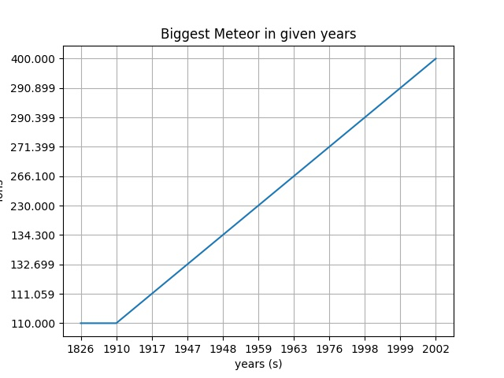

<html>

<h1> Data </h1>

<body>
<h2> Trump's Tweeted Words</h2>

This plot illustrates twitter word occurences. We already did the coding I needed for this plot, so I was very inspired to create a visualization for it.  <li><a href='https://github.com/bpb27/trump_tweet_data_archive'>Tweet data</a></li>

<h3><B> Meteor Data <B></h3>
<li><a href="https://data.nasa.gov/resource/y77d-th95.json">Meteor Data</a></li>

This plot modeled meteorite mass's in given years. I thought the increase was neat.
<li><a href="https://github.com/mikeizbicki/cmc-csci040/tree/2021fall/hw_02">hw2</a></li>
</body>

</html>